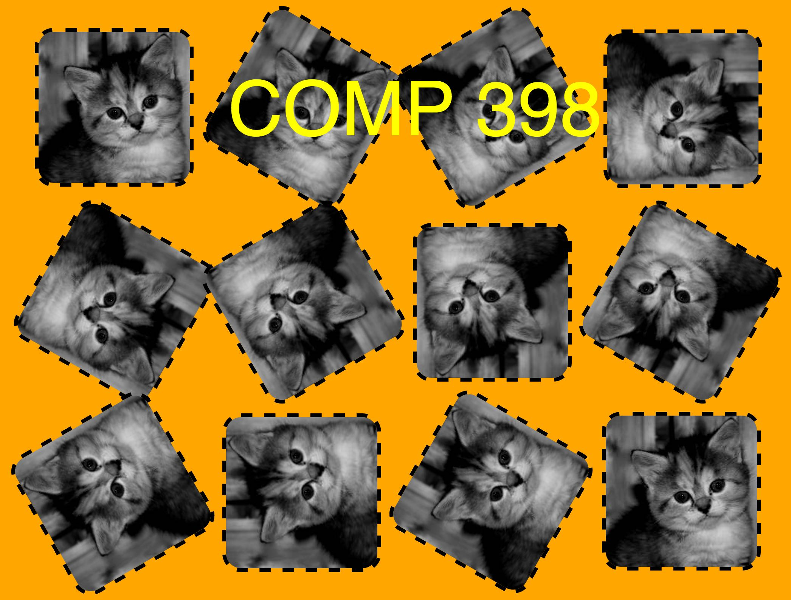

# COMP 398: Examination

Create a folder in your course repository named `exam`. Inside the folder, you will create at least four files: `prob1.html`, `prob2.html`, `prob3.html`, and `prob4.html` -- one for each of the following tasks. When in doubt, use inline/internal syntax rather than creating a separate file. Remember that you can and should ask questions, and all work will be evaluated using Chrome.

### Problem 1 -- HTML5 Validation

Using the [W3C Markup Validation Service](http://validator.w3.org/), transform the contents of [`prob1_start.html`](prob1_start.html) into valid HTML5 while preserving its content and organization in a file named `prob1.html`.

The following warnings are acceptable:

* Using experimental feature: HTML5 Conformance Checker.
* Using Direct Input mode: UTF-8 character encoding assumed

### Problem 2 -- CSS Manipulation

Construct a well-documented and validated submission, `prob2.html`, that approximately reconstructs what you see below. You are not required to use the same images, but can get your own from [placekitten](http://placekitten.com/). All images are 200 by 200 pixels.

### Problem 3 -- JS Coding

You are to display the numbers in the [Lazy Caterer's sequence](https://oeis.org/A000124) up to some input value of _n_ in a readable form using HTML, CSS, and JS. Make a valid HTML5 file, `prob3.html`, that accomplishes the following:

* Prompts the user to input a value for _n_ in a dialog box
* Displays an ordered -- starting at position 0 -- list of values (i.e., one value per line) of the first _n_ values of the Lazy Caterer's sequence
* **BONUS**: using whatever tools you would like, achieve the above, but display the output in a two-column, zebra striped table with column headings _n_ and _lazy caterer(n)_.

### Problem 4 -- Accessibility

Given the data contained in [`10day.json`](10day.json), construct a novel visualization using inline SVG in a file, `prob4.html`, that showcases some aspect(s) of the data. Assure that your HTML5 and SVG are in compliance with accessibility standards.